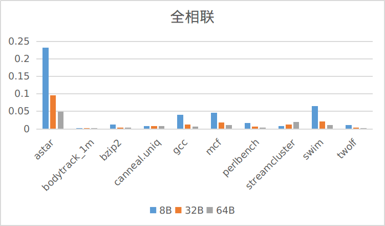
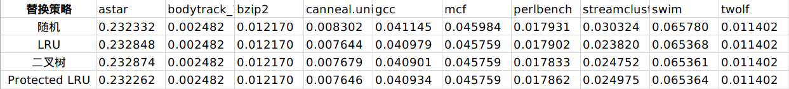

# 实验报告

> 计75  李阳崑  2017011235  li-yk17@mails.tsinghua.edu.cn

[TOC]

## 0 运行方法与说明

实验环境：gcc version 9.3.0 (Arch Linux 9.3.0-1)

运行方法：

在`cache-2017011235`文件夹下执行

```shell
g++ util.cpp BinaryTree.cpp LRUStack.cpp MUCounter.cpp CacheLine.cpp CacheGroup.cpp Cache.cpp main.cpp -o cache
```

编译得到可执行文件`cache`。然后执行命令

```shell
./cache <filename> <路数的对数> <块大小的对数> <写命中策略> <写缺失策略> <替换策略>
```

TODO

访问log在`log/`文件夹下，文件名的意思是


运行方法我也单独放在了`README.md`中。

## 1 代码实现

TODO

## 2 实验流程

下面介绍我按照实验说明`Cache.pdf`中列出的5个实验环节进行的实验、结果与分析。

### 2.1 读入trace

对于每种情况，我都测试了全部10个trace。其中只记录地址的`bodytrack.trace`、`conneal.uniq.trace`和`streamcluster.trace`我把所有的访问都当作read来处理。

### 2.2 实现cache模拟器

实现了一个布局灵活自由、支持4种写策略、4种替换策略的容量为128KB的cache模拟器。

布局：

组相联的路数可取 $2^{i}$ 路，块大小可取$2^{j}$B，其中整数 $i, j$ 只需满足 $0\leq i, j\leq 17$ 且 $i+j\leq17$ 即可。

写策略：

支持写分配+写回、写分配+写直达、写不分配+写回、写不分配+写直达4种写策略。

替换策略：

支持随机替换、LRU、二叉树、Protected LRU 4种替换策略。其中Protected LRU是参考文献 *Peress Y, Finlayson I, Tyson G, et al. CRC: Protected lru algorithm[C]. 2010.* 中提出的算法。

运行方法已在第0节中介绍，例如运行

```shell
./cache astar 4 3 0 0 1
```

表示测试`astar.trace`，16路组相联，块大小8B，写回+写分配，使用LRU替换策略；运行

```shell
./cache canneal.uniq 0 4 1 1 3
```

表示测试`canneal.uniq.trace`，直接映射，块大小16B，写直达+写不分配，使用Protected LRU替换策略。

### 2.3 不同cache布局

固定替换策略（LRU），固定写策略（写分配+写回），测试12种不同的 Cache 布局在10个trace上的缺失率：


原始数据见`ans.csv`

相同块大小下，不同的映射方式：


相同映射方式下，不同的块大小：





从数据上看，

对于相同的块大小，4种映射方式中相联度越高的在每一个trace上的缺失率越低。

对于相同的映射方式，3种块大小中块越大的缺失率越低。唯一的特例是`streamcluster.trace`，这个trace在低相联度的情况下对块大小不敏感，在高相联度（如全相联）的情况下块越大缺失率反而越高。

**结果分析**

相同块大小下，提高相联度可以减少冲突缺失，使得缺失率下降。代价是增加查找时间，比如全相联的运行时间就会比8-way组相联长很多。

相同映射方式下，增大块大小可以减少强制缺失，使得缺失率下降。代价是提高冲突缺失，因为增加块大小减少了cache line的数量。不过在本节实验的范围内（8B，32B，64B），这个副作用还未体现出来。

**元数据开销分析**

记相联度为 $ways$ ，块大小为 $offset$ 。cache总大小为128KB，可知index的个数为
$$
index = \dfrac{128K}{ways\times offset}
$$
地址总长度为64位，故Tag所占的位数为：
$$
\mathrm{Bits\ of\ tag} = 64 - \log(index) - \log(offset) = 47 + \log(ways)
$$
由此式可知，Tag的位数仅和相联度有关。加上1个valid位和1个dirty位，每个cache块的元数据开销空间为
$$
\mathrm{Bits\ of\ Metadata} = 49 + \log(ways)
$$
再乘上cache块的个数，就得出总的元数据空间开销：
$$
(49 + \log(ways))\times\dfrac{128K}{offset}\ \mathrm{bits} = (49 + \log(ways))\times\dfrac{16K}{offset}\ \mathrm{Bytes}
$$
带入本节实验的数据，可得：

|         | 直接映射 | 4-way组相联 | 8-way组相联 | 全相联 |
| :-----: | :------: | :---------: | :---------: | :----: |
| **8B**  |   98KB   |    102KB    |    104KB    | 126KB  |
| **32B** |  24.5KB  |   25.5KB    |    26KB     |  30KB  |
| **64B** | 12.25KB  |   12.75KB   |    13KB     |  15KB  |


### 2.4 不同替换策略

固定 Cache 布局（块大小 8B，8-way 组相联），固定写策略（写分配+写回），测试4种 Cache 替换策略在10个trace上的表现：



原始数据见`replace.csv`

TODO

#### 占用空间分析

**随机替换**

随机替换算法不额外占用空间。每次只需随机地从一组中挑出一个cache块替换即可。

**LRU**

LRU对于每个组（即每个index），需要一个大小为 $ways\times \log(ways)$ 位的栈来记录信息；记块大小为 $offset$ ，一共有 $index = \dfrac{128K}{ways\times offset}$ 个组，故总占用空间为 $\dfrac{128K}{offset}\times\log(ways)\ \mathrm{bits}$ .

这个结果也可以这样来理解：每个cache块需要 $\log(ways)$ 位来记录在本组中的位置，因此占用总空间是 cache块个数×$\log(ways)$ 位。

代入本实验数据，可得占用空间为 $3\times 16K\mathrm{bits} = 6KB$ .

**二叉树**

二叉树算法对于每个组，需要 $ways - 1$ 位来记录二叉树，$1$ 位用来记录是否所有路都valid（本实验中因为不需要，故没有实现这一位），即每组的额外开销为 $ways$ 位。一共有 $index = \dfrac{128K}{ways\times offset}$ 个组，故总占用空间为 $\dfrac{128K}{offset}\ \mathrm{bits}$ .

代入本实验数据，可得占用空间为 $16K\ \mathrm{bits} = 2KB$ .

**Protected LRU**

Protected LRU算法对于每个组，需要一个LRU栈，占用空间和LRU的相同；还需要一个MU计数器，在我的实现中每个cache块用 $4\ \mathrm{bits}$ 来记录，每组占用空间为 $4\times ways\ \mathrm{bits}$ ，总占用空间为 $\dfrac{128K}{offset}\times4\ \mathrm{bits}$ .

二者之和为 $\dfrac{128K}{offset}\times(\log(ways) + 4)\ \mathrm{bits}$ . 

代入本实验数据，可得占用空间为 $7\times 16K\ \mathrm{bits} = 14KB$ .

**汇总如下**：

|               |                          计算公式                           | 本实验数据 |
| :-----------: | :---------------------------------------------------------: | :--------: |
|   随机替换    |                             $0$                             |    $0$     |
|      LRU      |    $\dfrac{128K}{offset}\times\log(ways)\ \mathrm{bits}$    |   $6KB$    |
|    二叉树     |            $\dfrac{128K}{offset}\ \mathrm{bits}$            |   $2KB$    |
| Protected LRU | $\dfrac{128K}{offset}\times(\log(ways) + 4)\ \mathrm{bits}$ |   $14KB$   |

#### 替换时执行动作差异

**随机替换**

替换时随机在该组中选择一个替换。

**LRU**

替换时选择位于LRU栈栈底的cache块替换。替换完成后，将此块对应的位置移至栈顶，按规则维护LRU栈。

**二叉树**

替换时，按照二叉树查找规则，从树顶下溯至叶子节点，该叶子节点对应的cache块就是要被替换的块。替换完成后，从此叶子节点上溯，沿路更新二叉树节点的状态，按规则维护二叉树。

**Protected LRU**

在LRU的基础上有一个MU计数器，计数最多的`protected_size`个块被视为被保护的块。替换时，选择未被保护的块中在LRU栈中位置最靠下的一个进行替换，即未被保护的块中的LRU。替换完成后，按规则维护LRU栈，并将MU计数器对应的位置计数清零。

#### 对缺失率的影响

TODO


### 2.5 不同写策略

固定 Cache 布局（块大小 8B，8-way 组相联），固定替换策略（LRU），测试4种写策略在10个trace上的缺失率：


原始数据见`ans.csv`