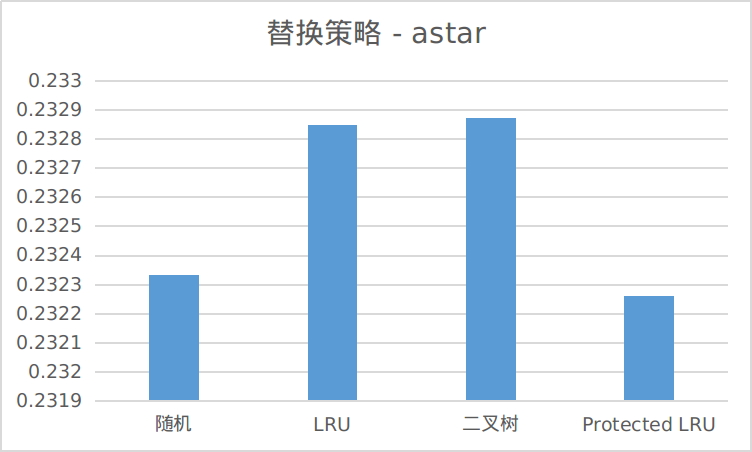
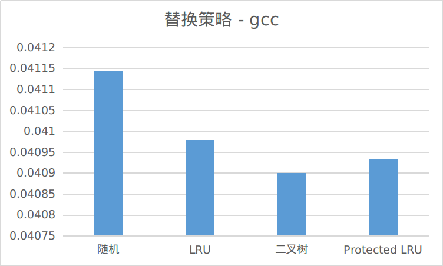
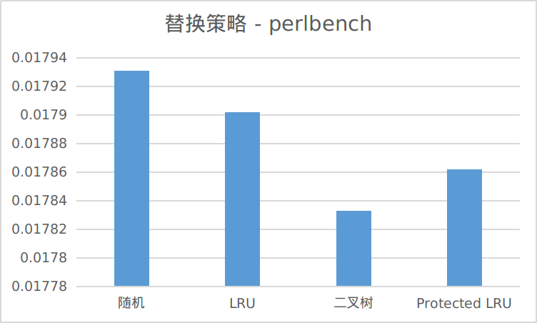
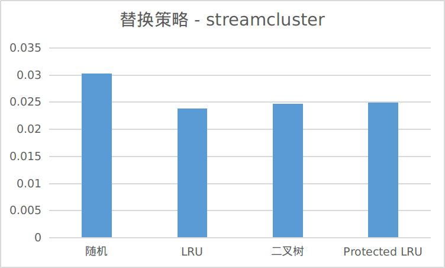
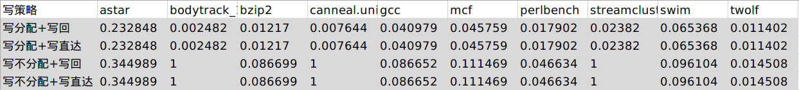
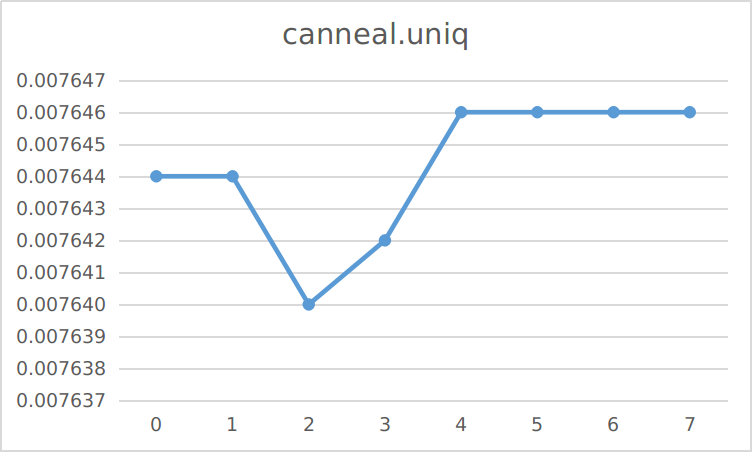
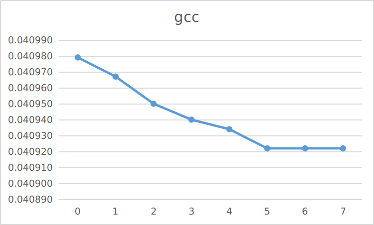
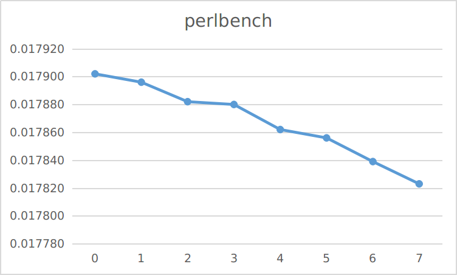
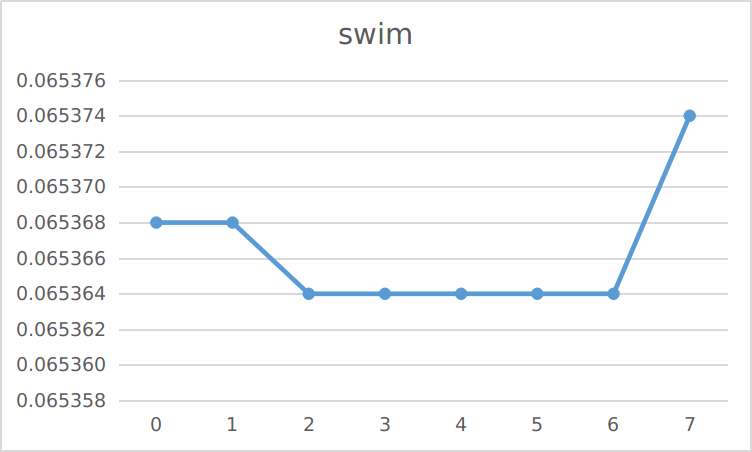

# 实验报告

> 计75  李阳崑  2017011235  li-yk17@mails.tsinghua.edu.cn

[TOC]

## 0 运行方法与说明

### 实验环境

gcc version 9.3.0 (Arch Linux 9.3.0-1)

### 编译

在`cache-2017011235`文件夹下执行

```shell
g++ util.cpp BinaryTree.cpp LRUStack.cpp MUCounter.cpp CacheLine.cpp CacheGroup.cpp Cache.cpp main.cpp -o cache
```

编译得到可执行文件`cache` （提交的内容中已经包含了可执行文件`cache`）

### 运行

本程序支持命令行传参运行，可以输入以下3种命令运行：

**(1)**

```shell
./cache
```

跑实验流程3 4 5部分的所有测例。12种布局，4种替换策略，4种写策略，每种情况在10个trace上进行测试，一共200个测例。缺失率结果统计会输出到 `ans.csv` 中。

这200个测例中包含了30个全相联的，每个全相联运行时间约1分钟，全部完毕需要30分钟左右。

**(2)**

```shell
./cache <option>
```

option可取的值和对应运行的实验见下表：

| option    | 实验                                                         | 结果输出文件  |
| --------- | ------------------------------------------------------------ | ------------- |
| replace   | 测试4种替换策略，即2.4节的实验                               | replace.csv   |
| write     | 测试4种写策略，即2.5节的实验                                 | write.csv     |
| p-lru     | 测试Protected LRU算法，即3.1节的实验，不过默认protected_size = ways/2 | p-lru.csv     |
| blocksize | 测试15种块大小，即3.2节的实验                                | blocksize.csv |
| ways      | 测试15种相联度，即3.2节的实验                                | ways.csv      |

运行示例：


**(3)**

```shell
./cache <filename> <log_ways> <log_offset> <写命中策略> <写缺失策略> <替换策略>
```

测试单个测例。6个参数可取的值和含义见下表：

|            | 可取的值                                                     | 含义                                                 |
| ---------- | ------------------------------------------------------------ | ---------------------------------------------------- |
| filename   | astar, bodytrack_1m, bzip2, canneal.uniq, gcc, mcf, perlbench, streamcluster, swim, twolf | 在哪个trace上测试                                    |
| log_ways   | $[0，17-\mathrm{log\_offset}]$                               | 相联度的对数                                         |
| log_offset | $[0，17-\mathrm{log\_ways}]$                                 | 块大小的对数                                         |
| 写命中策略 | 0, 1                                                         | 0 - 写回，1 - 写直达                                 |
| 写缺失策略 | 0, 1                                                         | 0 - 写分配，1 - 写不分配                             |
| 替换策略   | 0, 1, 2, 3                                                   | 0 - 随机替换，1 - LRU，2 - 二叉树，3 - Protected LRU |

这种情况只将缺失率结果输出到命令行，不输出到文件。（log还是会输出到文件）

运行示例：


### log

用户任意运行一个测例，其log都会输出到 `log/` 文件夹下。我将log的文件名统一定为

`<trace>_<ways>_<blocksize>_<wb/wt>_<wa/wn>_<replace strategy>.log`

的格式，以标记这个测例的条件。其中wb表示写回，wt表示写直达，wa表示写分配，wn表示写不分配。

要求提交的4个log在 `log/_8_8_wb_wa_lru.zip` 中。


这部分运行方法我也单独放在了`README.md`中。

<div STYLE="page-break-after: always;"></div>

## 1 代码实现

整个程序使用面向对象的方法实现。一共封装了6个类，其包含关系如下：


下面从底层向上层依次简要介绍6个类的实现。

**CacheLine**

定义在CacheLine.h，实现在CacheLine.cpp。

即Cache块。包含一个uint8_t类型的指针，指向储存的元数据。由于本实验中每个cache块元数据大小可能在49bits - 63 bits之间，因此采取了动态分配大小的方法进行初始化，根据输入的相联度参数决定申请7个字节还是8个字节。

元数据包含3个信息：valid位，dirty位，tag。因此提供的操作接口有：是否valid，是否dirty，读取tag值，设置valid位，设置dirty位，设置tag值。

**LRUStack**

定义在LRUStack.h，实现在LRUStack.cpp。

即LRU算法中的栈。包含一个uint8_t类型的指针，指向LRU栈。根据输入的相联度参数决定申请多少字节的内存。栈需要的位数为 $ways\times\log(ways)$ ，因此当 $ways \leq 4$ 时，申请1字节的空间；当 $ways \geq 8$ 时，申请 $ways\times\log(ways)/8$ 字节的空间。

提供的操作接口有：获得某个位置的cache块组内地址，获得该被替换的块的组内地址，更新LRU栈。

**BinaryTree**

定义在BinaryTree.h，实现在BinaryTree.cpp。

即二叉树算法中的二叉树。包含一个uint8_t类型的指针，指向储存的二叉树。根据输入的相联度参数决定申请多少字节内存。记录二叉树所需位数为 $ways-1$ ，因此当 $ways \leq 8$ 时，申请1字节空间；当 $ways \geq 16$ 时，申请 $ways/8$ 字节空间。

提供的操作接口有：获得该被替换的块的组内地址，更新二叉树。

**MUCounter**

定义在MUCounter.h，实现在MUCounter.cpp。

即LFU算法中的计数器，只不过在本实验中，因为是用于Protected LRU算法的实现，所以接口比真正的LFU要简单一些。包含一个uint8_t类型的指针，指向计数器。默认计数位数是4位，可以统计0-15范围内的次数，当有一个的计数溢出时，所有的计数右移一位进行衰减。根据输入的相联度参数决定申请多少字节内存。计数器所需位数为 $ways\times 4$ ，故申请 $ways/2$ 字节内存。

提供的操作接口有：获得一个cache块的计数，设置一个cache块的计数，增加一个cache块的计数，判断一个cache块是否被保护。

本实验中，默认保护一半cache块，即`protected_size` $= ways/2$

**CacheGroup**

定义在CacheGroup.h，实现在CacheGroup.cpp。

即cache组。包含CacheLine指针、LRUStack指针、BinaryTree指针、MUCounter指针各一个。

根据输入的相联度参数决定申请多少个CacheLine，即申请 $ways$ 个CacheLine。

根据输入的替换策略参数**决定是否申请**后三种对象。当替换策略为随机时，不申请；为LRU时，申请1个LRUStack；为二叉树时，申请1个BinaryTree；为Protected LRU时，申请1个LRUStack和1个MUCounter。这样就保证了空间开销最小。

提供的操作接口有：读组内指定位置的Cache块，写组内指定位置的Cache块。

**Cache**

定义在Cache.h，实现在Cache.cpp。

即cache。包含一个CacheGroup指针。根据输入的相联度、块大小参数决定申请多少个CacheGroup。

提供的操作接口有：改变cache的布局。


可以看到，我的所有数据的存储都使用动态申请内存的方法，具体申请内存的大小由命令行传入的参数决定。这样既最大限度地节约了空间，与硬件模拟实验的要求一致，又使得cache布局具有极大的灵活性。


剩下两个.cpp文件：

- util.cpp：定义了一些常用的二进制数组，用于位操作；以及常用的函数

- main.cpp：程序与用户交互的接口。通过命令行传参，在cache上批量运行用户想做的实验，并输出结果到命令行或文件。

<div STYLE="page-break-after: always;"></div>

## 2 实验流程

下面介绍我按照实验说明`Cache.pdf`中列出的5个实验环节进行的实验、结果与分析。

### 2.1 读入trace

对于每种情况，我都测试了全部10个trace。

对于其中只记录地址的 `bodytrack.trace`、`conneal.uniq.trace` 和 `streamcluster.trace`，在2.5节中为了显示不同写策略的区别，我把所有的访问都当作write来处理；在其它实验中，默认当作read来处理。


### 2.2 实现cache模拟器

实现了一个布局灵活自由、支持4种写策略、4种替换策略的容量为128KB的cache模拟器。

**布局**：

组相联的路数可取 $2^{i}$ 路，块大小可取$2^{j}$B，其中整数 $i, j$ 只需满足 $0\leq i, j\leq 17$ 且 $i+j\leq17$ 即可。

**写策略**：

支持写分配+写回、写分配+写直达、写不分配+写回、写不分配+写直达4种写策略。

**替换策略**：

支持随机替换、LRU、二叉树、Protected LRU 4种替换策略。其中Protected LRU是参考文献 *Peress Y, Finlayson I, Tyson G, et al. CRC: Protected lru algorithm[C]. 2010.* 中提出的算法。

运行方法已在第0节中介绍，例如运行

```shell
./cache astar 4 3 0 0 1
```

表示测试`astar.trace`，16路组相联，块大小8B，写回+写分配，使用LRU替换策略；运行

```shell
./cache canneal.uniq 0 4 1 1 3
```

表示测试`canneal.uniq.trace`，直接映射，块大小16B，写直达+写不分配，使用Protected LRU替换策略。


### 2.3 不同cache布局

在 `cache-2017011235/` 文件夹下运行 `./cache` 可复现本节结果。运行完毕需要约30分钟。

固定替换策略（LRU），固定写策略（写分配+写回），测试12种不同的 Cache 布局在10个trace上的缺失率：


原始数据见`ans.csv`

相同块大小下，不同的映射方式：


相同映射方式下，不同的块大小：


**对缺失率的影响**

对于相同的块大小，4种映射方式中相联度越高的在每一个trace上的缺失率越低。

对于相同的映射方式，3种块大小中块越大的缺失率越低。唯一的特例是`streamcluster.trace`，这个trace在低相联度的情况下对块大小不敏感，在高相联度（如全相联）的情况下块越大缺失率反而越高。

**结果分析**

相同块大小下，提高相联度可以减少冲突缺失，使得缺失率下降。代价是增加查找时间，比如全相联的运行时间就会比8-way组相联长很多。

相同映射方式下，增大块大小可以减少强制缺失，使得缺失率下降。代价是提高冲突缺失，因为增加块大小减少了cache line的数量。不过在本节实验的范围内（8B，32B，64B），这个副作用还未体现出来。3.2节的实验在更宽的范围内探究了块大小对缺失率的影响。

**元数据开销分析**

记相联度为 $ways$ ，块大小为 $offset$ 。cache总大小为128KB，可知index的个数为
$$
index = \dfrac{128K}{ways\times offset}
$$
地址总长度为64位，故Tag所占的位数为：
$$
\mathrm{Bits\ of\ tag} = 64 - \log(index) - \log(offset) = 47 + \log(ways)
$$
由此式可知，Tag的位数仅和相联度有关。加上1个valid位和1个dirty位，每个cache块的元数据开销空间为
$$
\mathrm{Bits\ of\ Metadata} = 49 + \log(ways)
$$
再乘上cache块的个数，就得出总的元数据空间开销：
$$
(49 + \log(ways))\times\dfrac{128K}{offset}\ \mathrm{bits} = (49 + \log(ways))\times\dfrac{16K}{offset}\ \mathrm{Bytes}
$$
带入本节实验的数据，可得：

|         | 直接映射 | 4-way组相联 | 8-way组相联 | 全相联 |
| :-----: | :------: | :---------: | :---------: | :----: |
| **8B**  |   98KB   |    102KB    |    104KB    | 126KB  |
| **32B** |  24.5KB  |   25.5KB    |    26KB     | 30.5KB |
| **64B** | 12.25KB  |   12.75KB   |    13KB     |  15KB  |

而LRU栈还需占用空间 $\dfrac{128K}{offset}\times\log(ways)\ \mathrm{bits} = \dfrac{16K}{offset}\times\log(ways)\ \mathrm{Bytes}$ ，加上后可得

|         | 直接映射 | 4-way组相联 | 8-way组相联 | 全相联 |
| :-----: | :------: | :---------: | :---------: | :----: |
| **8B**  |   98KB   |    106KB    |    110KB    | 154KB  |
| **32B** |  24.5KB  |   26.5KB    |   27.5KB    | 37.5KB |
| **64B** | 12.25KB  |   13.25KB   |   13.75KB   | 18.5KB |


### 2.4 不同替换策略

在 `cache-2017011235/` 文件夹下运行 `./cache replace` 可复现本节结果。

固定 Cache 布局（块大小 8B，8-way 组相联），固定写策略（写分配+写回），测试4种 Cache 替换策略在10个trace上的表现：


原始数据见 `replace.csv`

#### 对缺失率的影响

为了清晰，我将7个不同替换策略有不同结果的trace分别画图，剩下3个trace不同替换策略对缺失率无影响：









7个有影响的trace中，有6个在随机替换下缺失率最高。剩下1个，`astar.trace` 虽然LRU和二叉树未能起到优化作用，但用Protected LRU表现比随机替换好。说明在多数情况下，使用替换算法是可以有效降低缺失率的。

比较LRU和二叉树两种替换算法。在3个trace上LRU表现比二叉树好，在3个trace上二叉树表现比LRU好，在4个trace上二者表现一样，可以说二者难分伯仲，根据实际trace的特性不同二者会有不同的表现。

比较LRU和Protected LRU算法。可以看到在4个trace上Protected LRU表现好于LRU，在2个trace上LRU好于Protected LRU，在4个trace上二者表现一样。总体来说在LRU的基础上起到了正向优化的作用。对于`astar.trace`，LRU和二叉树的表现都是负优化，Protected LRU能很好地优化。这和`protected_size`的取值有一定关联，关于Protected LRU的性质我在3.1节中进行了更详细的探究。

#### 占用空间分析

**随机替换**

随机替换算法不额外占用空间。每次只需随机地从一组中挑出一个cache块替换即可。

**LRU**

LRU对于每个组（即每个index），需要一个大小为 $ways\times \log(ways)$ 位的栈来记录信息；记块大小为 $offset$ ，一共有 $index = \dfrac{128K}{ways\times offset}$ 个组，故总占用空间为 $\dfrac{128K}{offset}\times\log(ways)\ \mathrm{bits}$ .

这个结果也可以这样来理解：每个cache块需要 $\log(ways)$ 位来记录在本组中的位置，因此占用总空间是 cache块个数×$\log(ways)$ 位。

代入本实验数据，可得占用空间为 $3\times 16K\mathrm{bits} = 6KB$ .

**二叉树**

二叉树算法对于每个组，需要 $ways - 1$ 位来记录二叉树，$1$ 位用来记录是否所有路都valid（本实验中因为不需要，故没有实现这一位），即每组的额外开销为 $ways$ 位。一共有 $index = \dfrac{128K}{ways\times offset}$ 个组，故总占用空间为 $\dfrac{128K}{offset}\ \mathrm{bits}$ .

代入本实验数据，可得占用空间为 $16K\ \mathrm{bits} = 2KB$ .

**Protected LRU**

Protected LRU算法对于每个组，需要一个LRU栈，占用空间和LRU的相同；还需要一个MU计数器，在我的实现中每个cache块用 $4\ \mathrm{bits}$ 来记录，每组占用空间为 $4\times ways\ \mathrm{bits}$ ，总占用空间为 $\dfrac{128K}{offset}\times4\ \mathrm{bits}$ .

二者之和为 $\dfrac{128K}{offset}\times(\log(ways) + 4)\ \mathrm{bits}$ . 

代入本实验数据，可得占用空间为 $7\times 16K\ \mathrm{bits} = 14KB$ .

**汇总如下**：

|               |                          计算公式                           | 本实验数据 |
| :-----------: | :---------------------------------------------------------: | :--------: |
|   随机替换    |                             $0$                             |    $0$     |
|      LRU      |    $\dfrac{128K}{offset}\times\log(ways)\ \mathrm{bits}$    |   $6KB$    |
|    二叉树     |            $\dfrac{128K}{offset}\ \mathrm{bits}$            |   $2KB$    |
| Protected LRU | $\dfrac{128K}{offset}\times(\log(ways) + 4)\ \mathrm{bits}$ |   $14KB$   |

#### 替换时执行动作差异

**随机替换**

替换时随机在该组中选择一个替换。

**LRU**

替换时选择位于LRU栈栈底的cache块替换。替换完成后，将此块对应的位置移至栈顶，按规则维护LRU栈。

**二叉树**

替换时，按照二叉树查找规则，从树顶下溯至叶子节点，该叶子节点对应的cache块就是要被替换的块。替换完成后，从此叶子节点上溯，沿路更新二叉树节点的状态，按规则维护二叉树。

**Protected LRU**

在LRU的基础上有一个MU计数器，计数最多的`protected_size`个块被视为被保护的块。替换时，选择未被保护的块中在LRU栈中位置最靠下的一个进行替换，即未被保护的块中的LRU。替换完成后，按规则维护LRU栈，并将MU计数器对应的位置计数清零。


### 2.5 不同写策略

在 `cache-2017011235/` 文件夹下运行 `./cache write` 可复现本节结果。

注：本节实验中3个仅含地址的trace我把所有操作当作write来处理。

固定 Cache 布局（块大小 8B，8-way 组相联），固定替换策略（LRU），测试4种写策略在10个trace上的缺失率：



原始数据见`write.csv`


#### 写回 or 写直达

**对缺失率的影响**

可以看到，在其他条件相同的情况下，写命中策略（写回或写直达）对缺失率没有影响。这是因为写回或写直达只决定是否用dirty位记录cache块的状态，在替换时，前者会根据dirty位决定是否将cache里的内容写回memory；后者无dirty位，直接替换不需要写回。二者只是在是否将cache里的内容写回memory这一点上有差别，选择哪一块进行替换并无影响，对cache替换算法的执行也无影响，因此在本实验中结果是一样的。

**元数据开销**

写回策略每个元数据需要1个bit作为dirty位，写直达策略不需要。

由2.3节的结论，对于路数为 $ways$ ，块大小为 $offset\ \mathrm{B}$ 的cache，其tag的位数为 $47 + \log(ways)$ 。因此写回策略每个cache块的元数据有 $49 + \log(ways)$ 位，写直达策略为 $48 + \log(ways)$ 位。代入本节实验的数据，cache块的个数为 $16K$ 个，$ways = 8$ ，有

|        | 每块元数据 / bits | 元数据总大小 / Bytes |
| :----: | :---------------: | :------------------: |
|  写回  |        52         |        104KB         |
| 写直达 |        51         |        102KB         |

加上LRU栈的开销，为

|        | 每块元数据 / bits | 元数据总大小 / Bytes |
| :----: | :---------------: | :------------------: |
|  写回  |        55         |        110KB         |
| 写直达 |        54         |        108KB         |

#### 写分配 or 写不分配

**对缺失率的影响**

在所有trace上写分配的缺失率都低于写不分配。这是因为在写缺失发生时，写不分配直接写入下一级存储而不将其调入cache，这样在下一次访问同一个地址时必然会缺失。如果下一次访问是read，则会缺失1次；如果下一次访问还是write，则还会继续缺失 $\geq2$ 次。与之相比，同样情况下，写分配策略则会将其调入cache，这样下一次访问不论是read还是write都不会发生缺失。

**特殊trace上的表现**

对于`bodytrack.trace`、`conneal.uniq.trace` 和 `streamcluster.trace` 三个trace，所有操作都是write，写不分配策略每次都只直接写入memory而不调入cache，因此每次都会缺失，缺失率为1。由此我们可大致知道，对于write占大部分的情况，写分配的表现会比写不分配要好；对于只有write的极端情况，写不分配缺失率为1。


## 3 扩展

### 3.1 尝试其他cache替换方法

在 `cache-2017011235/` 文件夹下运行 `./cache p-lru` 可复现本节protected_size=4的结果。

实现了Protected LRU替换算法。

参考文献： *Peress Y, Finlayson I, Tyson G, et al. CRC: Protected lru algorithm[C]. 2010.* 

本算法是LRU和LFU替换算法的结合。其思想是：用LFU的计数器记录该组中每个cache块被访问的次数，访问次数最多的 `protected_size` 个cache块被认为是MU(Most Used)的，因此被保护；对不被保护的块执行LRU替换算法。根据文献，这种先用LFU划定范围、再用LRU选出一个的结合方式比先用LRU划定范围，再用LFU选出一个的结合方式要好。

本算法一个可以改变的量是 `protected_size` 的大小。固定cache布局（块大小8B，8-way组相联），固定写策略（写分配+写回），测试了不同 `protected_size` 大小对缺失率的影响：


其中 `protected_size` = 0时就退化成LRU算法，将其作为对照，缺失率最低的size在上表中标为白色。

下面把有效果（正或反）的trace做可视化：







可以看到不同trace的表现差异较大。对于 `astar.trace` 、 `gcc.trace` 、 `perlbench.trace`，Protected LRU在任一 `protected_size` 下的表现都比LRU要好很多；对于 `bodytrack_1m.trace`、`bzip2.trace`、`mcf.trace`、`twolf.trace`，二者没有差别；对于 `streamcluster.trace` ，Protected LRU表现反而比LRU坏，而且随着 `protected_size` 的增大表现越来越坏。

而对于有优化效果的trace，表现最好时的 `protected_size` 值也不尽相同。对于 `canneal.uniq.trace` ，Protected LRU在 `protected_size` = 2时表现最好；对于 `astar.trace`、`perlbench.trace`、 `gcc.trace` ，Protected LRU在 `protected_size` = 6左右表现最好。

总体上来看，取6 - 7左右时优化效果最好的情况最多，protected_size占路数的 $\dfrac{6}{8}$ 至 $\dfrac{7}{8}$。原论文中cache是16路组相联，其表现最好的size基本分布在10 - 14，占路数的 $\dfrac{5}{8}$ 至 $\dfrac{7}{8}$，和本实验的结果也是吻合的。


**工作效果与trace的关系**

`protected_size` 的大小本质上反映的是LFU在这个算法中所占的权重。 `protected_size` = 0时，算法即退化成LRU； `protected_size` = ways - 1 时，留给LRU的选择余地只有一个块，即LRU未起到作用，选出来的一个块就是LFU (Least Frequently Used) 。

因此，对于具有“倾向于访问之前访问次数更多的块”性质的trace， `protected_size` 的存在会使其表现更好，且这个性质越强， `protected_size` 越大对它越有利，如 `astar.trace` 、 `gcc.trace`、`perlbench.trace`、 `swim.trace` 。这条性质的具体表现为在很久之前经常访问的块，一段时间不访问，之后还会再次频繁访问。

对于具有“只倾向于访问最近访问的块”性质的trace， `protected_size` 不宜太大，且这个性质越强， `protected_size` 对其副作用越明显，如 `canneal.uniq.trace` 、`streamcluster.trace` 。这条性质的具体表现为在很久之前经常访问的块，一段时间不访问，之后就不会频繁访问了。如程序中的两个循环，第一个执行完之后就不会再执行，其对应的内存地址被访问的次数很多，如果 `protected_size` 很大，这些内存地址就被保护起来，在进入第二个循环很长一段之间之后才会因为计数衰减而被替换掉，造成大量缺失。


### 3.2 cache优化

探究了cache优化PPT中降低缺失率的法1和法3，即增加块大小和提高相联度。

#### 块大小

在 `cache-2017011235/` 文件夹下运行 `./cache blocksize` 可复现本节结果。

固定相联度（8-way组相联），固定写策略（写分配+写回），固定替换策略（LRU），测试所有可能的15种块大小在10个trace上的缺失率：


标红的是每个trace上最小的缺失率。为了使数据更明显，根据缺失率的数量级将10个trace分成4组进行可视化：


可以看到，在所有的trace上，缺失率都随着块大小增大先降低后升高（也有个别的一直降低），这和课上讲的结论是一致的。

缺失率最低的点基本出现在1024B - 4096B，最小的也有128B，比较大，比我们本实验默认采用的8B要大得多。是不是取缺失率最低点的块大小就是最好的呢？

实际的cache除了缺失率还要考虑缺失损失，块越大，每缺失一次需要读写的数据量就越大，缺失损失也就越大。因此不能一味地追求低缺失率，合适的块大小应该比最低点要小。

在元数据空间开销方面，由于元数据总量是 $(49 + \log(ways))\times\dfrac{16K}{offset}\ \mathrm{Bytes}$ ，因此在相联度相同的情况下增加块大小可以减小元数据开销。

#### 相联度

在 `cache-2017011235/` 文件夹下运行 `./cache ways` 可复现本节结果。

固定块大小（8B），固定写策略（写分配+写回），固定替换策略（LRU），测试所有可能的15种相联度在10个trace上的缺失率：


为了使数据更明显，根据缺失率的数量级将10个trace分成4组进行可视化：


可以看到，在几乎所有trace上，缺失率和相联度的关系为：在低相联度时，提高相联度可以较为显著地降低缺失率；在高相联度时，提高相联度，缺失率的降低并不显著。

而提高相联度会增加查找时间，对于本实验的cache模拟器，8-way组相联几秒钟就能跑完10个测例，全相联（相当于16384-way组相联）每个测例要跑1分钟；对于硬件来说因为多路比较器的存在还会增大占用面积。因此，取缺失率有显著降低的最后一个点即可，对于大多数trace来说是4-way或8-way。这也印证了课件中“采用相联度超过8的方案的实际意义不大”的说法。

在元数据空间开销方面，由于元数据总量是 $(49 + \log(ways))\times\dfrac{16K}{offset}\ \mathrm{Bytes}$ ，因此在块大小相同的情况下增加相联度会加大元数据开销。


## 4 总结

独立从零开始实现了一个模拟的cache系统，对自己面向对象编程能力是一次巩固和提高，对实现细节的过程也是对cache工作原理的进一步加深理解，阅读论文使自己了解到了课本上没有的新算法思路，命令行传参的设计也再次锻炼了自己的软件能力。总之，十分感谢这次的cache实验，感谢辛勤付出的老师和助教！